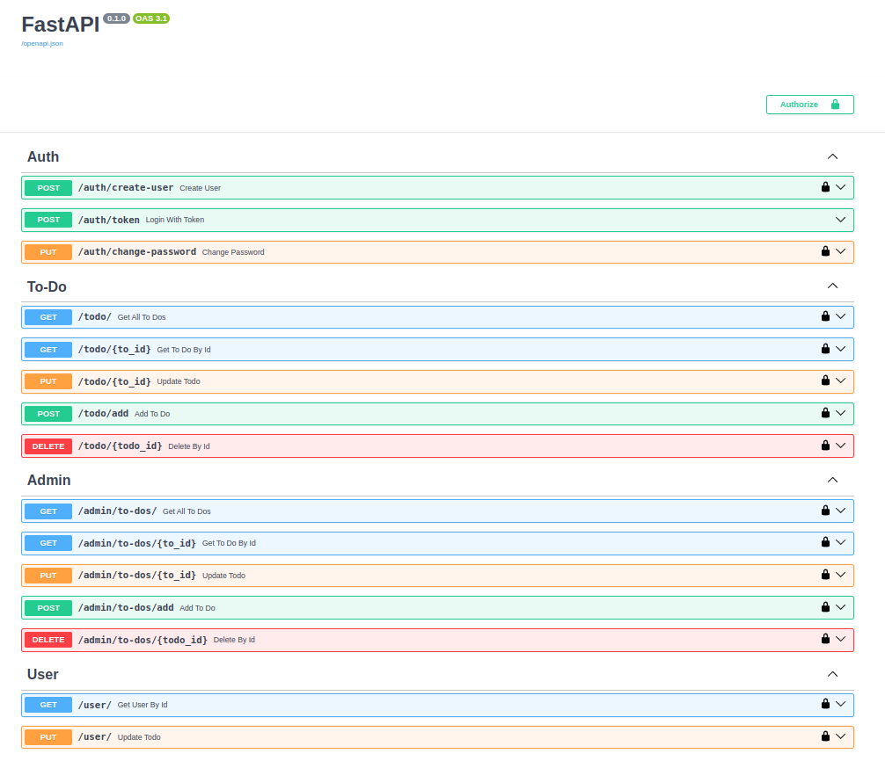

# TodoApp

FastAPI Application for Managing a TODO List
This application allows users to add and manage TODO items. It includes separate endpoints for regular users and administrators.

**Installation steps**

* python3 -m venv fastapienv 
* source fastapienv/bin/activate
* cd TodoApp/
* setup .env file
* pip install -r requirements.txt
* fastapi dev main.py

**.env file sample:**

1. [ ] `SECRET_KEY  = "c82e5b95421ac6435c6828c32dfd09bdbec56f2cb3de823d5a5a6a632df0925a"
2. [ ] ALGORITHM = "HS256"
3. [ ] JWT_TOKEN_EXPIRY = 20
4. [ ] DB_USER_NAME = "postgres"
5. [ ] DB_PASSWORD = "password"
6. [ ] DB_HOST = "localhost"
7. [ ] DB_PORT = "5432"
8. [ ] DB_NAME = "ToDoApplicationDatabase"`

